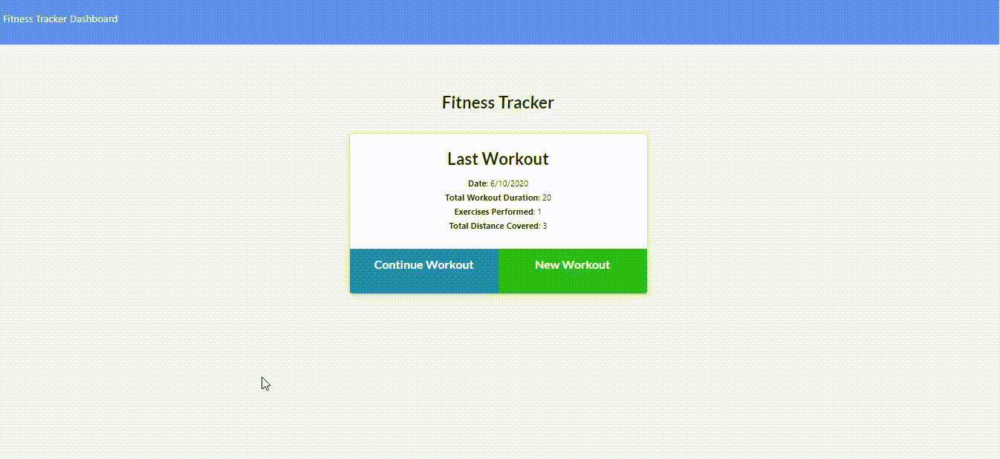

# Fitness-Tracker

Allows the user to track a workout. Various attributes of the workouts can be stored. The workouts are saved in a Mongo database.

### Deployed Heroku URL
https://safe-crag-29613.herokuapp.com/

## Table of Contents
   * [User Story](#user-story)
   * [Description](#description)
   * [Usage](#usage)
   * [Built with](#built-with)
   * [Installation](#installation)
   * [Badges](#badges)
   * [Contributing](#contributing)
   * [License](#license)
   * [Tests](#tests)
   * [Visuals](#visuals)

## User Story
```
As a user, I want to be able to view create and track daily workouts. 
I want to be able to log multiple exercises in a workout on a given day. 
I should also be able to track the name, type, weight, sets, reps, and duration of exercise. 
If the exercise is a cardio exercise, I should be able to track my distance traveled.

```

## Description

This application allows the user to create and track their workouts. They can keep track of multiple exercises in a workout. 
The user has the option to record either a resistance or cardio exercise. A resistance exercise will contain the following information: name, weight, sets, reps and duration, while a cardio exercise has name, duration and distance traveled.

## Badges
[](https://img.shields.io/github/followers/sujatha-m?style=social)
[](https://img.shields.io/website?url=https%3A%2F%2Fsujatha-m.github.io%2FWeather-Dashboard%2FDevelop%2F)


## Visuals



## Built with
* JavaScript
* NodeJS
* Node Packages:
* Express
* mongoDB
* mongoose
* morgan

## Installation 
Run npm install to install all dependencies. To use the application locally, run node server.js in your CLI, and then open http://localhost:3000 in your preferred browser. The Fitness Tracker app is live on Heroku for you to use as well.

## Usage
```sh
      node server.js  
```

## Contributing
Pull requests are welcome. For major changes, please open an issue first to discuss what you would like to change.
Please make sure to update tests as appropriate.


## License 
[](https://img.shields.io/npm/l/isc?color=Blue&style=plastic)

## Questions
# 

jhanavi.bhushan@gmail.com